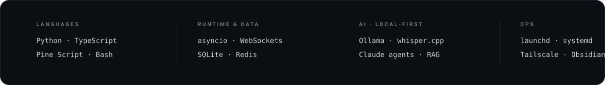

<picture>
  <source media="(prefers-color-scheme: dark)" srcset="assets/hero-dark.svg">
  <source media="(prefers-color-scheme: light)" srcset="assets/hero-light.svg">
  
</picture>

I build autonomous research infrastructure for markets: knowledge engines that read
video, filings and tick data; a backtesting lab that reprices every strategy with
real costs; and agents that review each other's work before anything reaches a
decision.

Most of it runs privately, 24/7, on a Mac and a small VPS — local-first, with $0
inference wherever a local model is good enough. The one rule: **nothing trades
live without a measured edge.** Gross-vs-net has killed more of my strategies than
the market has, and the pages below say so out loud.

 

<picture>
  <source media="(prefers-color-scheme: dark)" srcset="assets/system-map.svg">
  <source media="(prefers-color-scheme: light)" srcset="assets/system-map-light.svg">
  
</picture>

 

## Selected work

### Research engines

| System | What it does |
|:--|:--|
| **Wyckoff engine** | **Full-market crypto scanner.** Top-30 on 1h/4h, structural ranges, closed-candle analysis, live re-ruling of open positions. `audit: 79% of drawdown → one sizing rule` |
| **Fundamental engine** | **Ticker → 26 KPIs in five layers.** Every threshold traced to its source frame; XBRL from SEC EDGAR, mapped period-first. `provenance: 100% of thresholds` |
| **Council** | **Five engines argue, a skeptic rules.** One ticker in parallel, contradiction matrix, verdict on net R:R. `disagreement is the signal` |
| **sportsbrain** | **Prices sport prediction markets.** Point-level Markov, corrected for intra-match correlation. Best result was negative. `0 structural arbs / 143 markets` |

### Decision infrastructure

| System | What it does |
|:--|:--|
| **Backtest Lab** | **Nightly, automated, honest.** Per-asset-class cost models, 10 gates before any adoption. Once proved a strategy's whole "edge" was its commission model. `verdict: NO_EDGE` |
| **Execution layer** | **Paper-first broker execution.** An engine gets live capital only after its verdict survives statistical review. `57 tests · gate says "no" more than "yes"` |
| **Cockpit** | **One command center for everything.** Live dashboards, alert routing with dedup and budgets, margin guard. Missing data renders as `—`, never as a guess. |

### Knowledge &amp; tooling

| System | What it does |
|:--|:--|
| **video2brain** | **Video → knowledge vault.** whisper.cpp transcription into five-layer vaults; every claim carries its exact source quote, QA-scored 0–100. `powers 12+ domain vaults` |
| **graphify** | **Codebase → queryable knowledge graph.** God-node detection, community clustering, EXTRACTED / INFERRED / AMBIGUOUS audit trail. `deterministic · $0 in code-only mode` |
| **OTE Master** | **Live TradingView indicator.** Six ICT / price-action modules in Pine Script — OTE zones, session levels, structure breaks — shipped through an automated deployment loop. |

 

## How I work

- **Measured over assumed.** Every edge claim gets a backtest with real costs before it gets an opinion.
- **Honest UX.** Missing data shows as missing; small samples get flagged as small. Numbers the system can't defend don't get rendered.
- **Local-first, $0 by default.** Ollama, whisper.cpp and SQLite before any paid API — the nightly loops cost nothing to run.
- **Adversarial review.** Agents audit agents, and a skeptic gets the last word before anything ships.

 

<picture>
  <source media="(prefers-color-scheme: dark)" srcset="assets/stack.svg">
  <source media="(prefers-color-scheme: light)" srcset="assets/stack-light.svg">
  
</picture>

 

Jerusalem · Hebrew &amp; English · most of this work is private — for a walkthrough of any of it: <a href="mailto:yehonatangalo27@gmail.com">yehonatangalo27@gmail.com</a>
